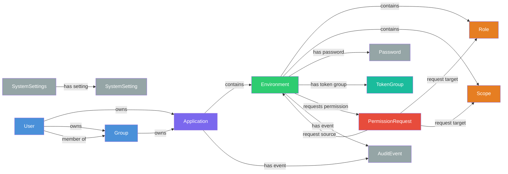

# Pontifex

Management layer that makes Azure Entra ID AWESOME!

Pontifex provides a graph-based management UI and API for Azure AD application registrations, environments, roles, scopes, groups, and permission workflows.

## Tech Stack

| Layer | Technology |
|-------|-----------|
| Backend | NestJS 11, TypeScript |
| Frontend | Next.js 15, React 19, Chakra UI |
| Auth | Azure Entra ID (MSAL v5, Passport) |
| Database | Apache TinkerPop Gremlin (TinkerGraph) |
| Infrastructure | Docker Compose, Traefik v3 |
| Testing | Jest, Playwright |

## Architecture

```
Browser
  │
  ├── https://app.pontifex.localhost:8443  (UI)
  └── https://api.pontifex.localhost:8443  (API)
        │
     Traefik (TLS termination, routing)
        │
        ├── pontifex-ui   (Next.js :3000)
        ├── pontifex-api   (NestJS :3001)
        └── pontifex-gremlin (Gremlin Server :8182)
```

On startup, the API bootstraps:
- **Pontifex_Admins** Azure AD group (created if missing, synced from AAD, tagged with `[pontifex-managed]` description)
- **System settings** stored as Gremlin vertices (admin group reference, environment levels)
- **Pontifex application** with a real AAD-backed environment and admin token group
- **Azure Entra tagging** — the Pontifex app registration is tagged with `pontifex-managed` for disaster recovery

## Prerequisites

- Docker & Docker Compose
- Node.js 22+
- An Azure AD tenant with an app registration

## Setup

### 1. Clone and install dependencies

```bash
git clone <repo-url> && cd pontifex
cd api && npm install && cd ..
cd ui && npm install && cd ..
```

### 2. Configure environment variables

**API** (`api/.env`):

```env
PONTIFEX_DATABASE_ENDPOINT=ws://localhost:8182/gremlin
PONTIFEX_CLIENT_ID=<your-azure-app-client-id>
PONTIFEX_CLIENT_SECRET=<your-azure-app-client-secret>
PONTIFEX_TENANT_ID=<your-azure-tenant-id>
```

**UI** (`ui/.env`):

```env
NEXT_PUBLIC_CLIENT_ID=<your-azure-app-client-id>
NEXT_PUBLIC_AUTHORITY=https://login.microsoftonline.com/<your-tenant-id>
NEXT_PUBLIC_APIM_URL=https://api.pontifex.localhost:8443/api
```

### 3. Start everything

```bash
docker compose up -d
```

| Service | URL |
|---------|-----|
| UI | https://app.pontifex.localhost:8443 |
| API | https://api.pontifex.localhost:8443/api |
| Swagger | https://api.pontifex.localhost:8443/api |
| Traefik Dashboard | http://localhost:8283 |
| Gremlin | ws://localhost:8182/gremlin |

## Development

The API and UI containers mount source directories and support hot reload.

### API only (outside Docker)

```bash
cd api
npm run start:dev
```

### UI only (outside Docker)

```bash
cd ui
npm run dev
```

## Testing

### Unit tests

```bash
# API unit tests
cd api && npm test

# From root
npm run test:api:unit
```

### Integration tests (requires running Gremlin)

```bash
npm run test:api:integration
```

### E2E tests (requires full stack running)

Configure `ui/.env.test`:

```env
TEST_USER_EMAIL=<test-user-email>
TEST_USER_PASSWORD=<test-user-password>
TEST_USER_TOTP_SECRET=<optional-base32-totp-secret>
```

```bash
# UI e2e
cd ui && npm run test:e2e

# Full-stack integration e2e
cd e2e && npx playwright test

# All tests
npm run test:all
```

## Scripts

Scripts live in `api/scripts/` and run via `npx ts-node` from the `api/` directory.

### Rebuild Gremlin from Azure Entra

Reconstructs the Gremlin graph database from Azure Entra state. Works like Terraform — plan first, review, then apply.

```bash
cd api

# Generate a plan (queries Azure Entra + Gremlin, shows diff)
npx ts-node scripts/rebuild-gremlin-from-aad.ts plan [plan.json]

# Apply the plan (executes all operations against Gremlin)
npx ts-node scripts/rebuild-gremlin-from-aad.ts apply <plan.json>
```

All operations are idempotent upserts — safe to run against an existing graph for repair/sync without data loss.

The script discovers Pontifex-managed resources by:
- `pontifex-managed` tag on AAD app registrations
- Service principal app role assignments (to discover groups)
- `Pontifex_Admins` group by name

It reconstructs: applications, environments, roles, scopes, groups, users, token groups, passwords, and permission requests. Audit events cannot be recovered.

### Cleanup E2E test apps

Deletes stale Azure AD app registrations created by e2e tests (apps with `e2e-` prefix).

```bash
cd api
npx ts-node scripts/cleanup-aad-apps.ts [--dry-run]
```

## Project Structure

```
pontifex/
├── api/                        # NestJS backend
│   ├── scripts/               # CLI scripts (rebuild, cleanup)
│   └── src/
│       ├── modules/
│       │   ├── admin/          # Admin endpoints (Gremlin queries, graph viz)
│       │   ├── application/    # App registration management + orchestration
│       │   ├── environment/    # Environment (dev/test/qa/prod) management
│       │   ├── gremlin/        # Graph DB client & shared queries
│       │   ├── group/          # Azure AD group management & sync
│       │   ├── permission-request/ # Cross-app permission workflows
│       │   ├── pontifex-aad/   # Azure AD client wrapper
│       │   ├── role/           # App role management
│       │   ├── scope/          # OAuth2 scope management
│       │   ├── system-settings/ # Bootstrap & system configuration
│       │   ├── token-group/    # Token group & app role assignment
│       │   └── user/           # User management
│       └── common/             # Guards, decorators, types, utilities
├── ui/                         # Next.js frontend
│   ├── pages/                  # Route pages
│   ├── components/             # React components
│   └── e2e/                    # UI-focused Playwright tests
├── e2e/                        # Full-stack Playwright tests
├── terraform/                  # Terraform provider for Pontifex
├── gremlin/                    # Gremlin Server configuration
├── .traefik/                   # Traefik TLS certs & config
└── docker-compose.yml
```

## Graph Data Model

Pontifex stores its data as vertices and edges in a Gremlin property graph database.



All edges are stored bidirectionally (e.g., `owns` / `owned by`, `contains` / `contained by`). The diagram shows the primary direction.

**Key traversal** — finding all apps a user has access to (direct + group ownership):

```gremlin
g.V(userId)
  .union(
    fold().unfold(),
    out("owns").has("type", "group"),
    out("member of")
  )
  .out("owns").has("type", "application")
  .dedup()
```

## Service Dependency Graph

The API is organized as NestJS modules with a layered dependency structure. The `ApplicationOrchestrationService` sits above the domain services to coordinate complex multi-resource operations (cascade deletes, role updates with permission request cleanup) without creating circular dependencies.

```mermaid
graph TD
    subgraph Orchestration
        AppOrch[ApplicationOrchestrationService]
    end

    subgraph Domain Services
        AppSvc[ApplicationService]
        EnvSvc[EnvironmentService]
        PRSvc[PermissionRequestService]
        UserSvc[UserService]
        GroupSvc[GroupService]
        RoleSvc[RoleService]
        ScopeSvc[ScopeService]
        TokenSvc[TokenGroupService]
        PwSvc[PasswordService]
        AuditSvc[AuditEventService]
        SysSvc[SystemSettingsService]
    end

    subgraph Infrastructure
        Gremlin[GremlinService]
        GraphQ[GraphQueryService]
        AAD[PontifexAadService]
        Email[EmailService]
    end

    AppOrch --> AppSvc
    AppOrch --> EnvSvc
    AppOrch --> PRSvc
    AppOrch --> PwSvc
    AppOrch --> RoleSvc
    AppOrch --> ScopeSvc
    AppOrch --> AuditSvc
    AppOrch --> AAD
    AppOrch --> Gremlin

    AppSvc --> Gremlin
    AppSvc --> GraphQ

    EnvSvc --> Gremlin
    EnvSvc --> PwSvc
    EnvSvc --> RoleSvc
    EnvSvc --> ScopeSvc
    EnvSvc --> AuditSvc
    EnvSvc --> AAD

    PRSvc --> Gremlin
    PRSvc --> RoleSvc
    PRSvc --> ScopeSvc
    PRSvc --> Email
    PRSvc --> AAD

    UserSvc --> Gremlin
    UserSvc --> GraphQ

    GroupSvc --> Gremlin
    GroupSvc --> AAD

    TokenSvc --> Gremlin
    TokenSvc --> AAD

    SysSvc --> AppSvc
    SysSvc --> EnvSvc
    SysSvc --> UserSvc
    SysSvc --> GroupSvc
    SysSvc --> TokenSvc
    SysSvc --> AAD
    SysSvc --> Gremlin

    RoleSvc --> Gremlin
    ScopeSvc --> Gremlin
    PwSvc --> Gremlin
    AuditSvc --> Gremlin
    GraphQ --> Gremlin

    style AppOrch fill:#E74C3C,color:#fff
    style Gremlin fill:#2ECC71,color:#fff
    style GraphQ fill:#2ECC71,color:#fff
    style AAD fill:#4A90D9,color:#fff
    style Email fill:#4A90D9,color:#fff
```



Dependencies flow strictly downward — no circular references or `forwardRef` usage.
